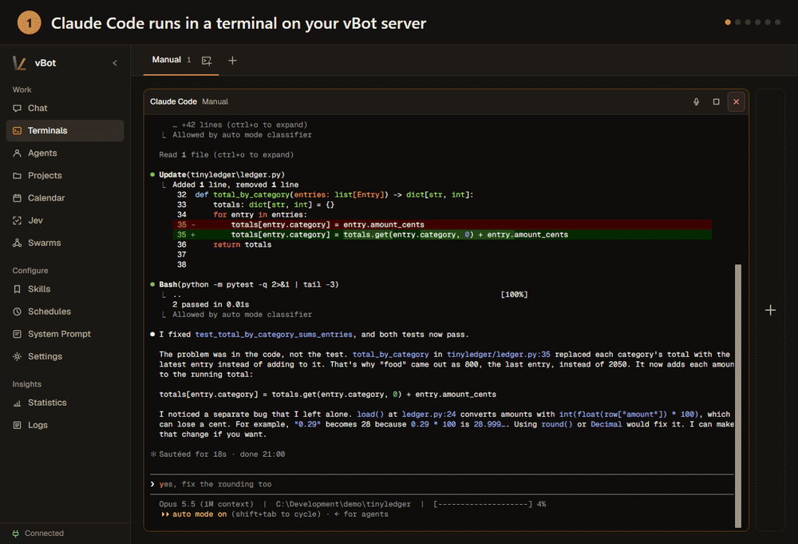

<p align="center">
  
</p>

<h1 align="center">vBot</h1>

<p align="center"><strong>Keep your coding agents working when you step away.</strong></p>

<p align="center">
  A self-hosted home for AI Agents. Run Claude Code, Codex and other coding CLIs in terminals on your vBot server,
  hand a terminal to an Agent when you leave, steer everything by voice, and put whole swarms of Agents on one goal.
</p>

<p align="center">
  <a href="https://github.com/Vironnimo/vbot/releases"></a>
  <a href="LICENSE"></a>
  
  
</p>

<p align="center">
  <a href="#get-started">Get started</a> ·
  <a href="#what-vbot-does">Features</a> ·
  <a href="USAGE.md">User guide</a> ·
  <a href="#security">Security</a>
</p>

<p align="center">
  
</p>

## What vBot does

### Terminals that keep going without you

Start Claude Code, Codex, OpenCode or any other interactive program in a real terminal. The terminals run on the machine where the vBot server runs; your browser, the Desktop app or your phone only shows them, so you can close the tab and come back later.

When you step away, hand a terminal to an Agent. It attaches to the running session, reads the screen, answers questions, types the next instruction and tells you when the work is done, in the WebUI or through Telegram, Discord and the other messaging Channels. Agents can also start their own terminals.

<p align="center">
  
</p>

### Talk to it

Live voice (preview) connects a realtime voice Model, OpenAI GPT-Live or xAI Grok Voice, to the app itself. Say *"start three Codex terminals in my project"*, *"tell Atlas to continue"* or *"what is the status?"*: it opens and arranges terminals, passes tasks to your Agents and checks on them, and it speaks up when a Run finishes or an Agent has a question. Every terminal also has a microphone button for dictating into the program.

### Swarms: many Agents, one goal

Give a Swarm a goal and a working directory. Each participant gets its own Session and Model, and they coordinate on a shared Board, keep a Wiki together and address each other directly. Mix Models from different Providers in one Swarm, follow the discussion live and step in with your own posts.

<p align="center">
  
</p>

### Agents that stay with you

- **Persistent Agents** keep their own Memory, Skills, permissions and Sessions across restarts.
- **Reach them anywhere:** WebUI, Desktop app, CLI, Telegram, Discord, Slack, WhatsApp and Mattermost all talk to the same Agents and Sessions.
- **Scheduled and background work:** Cron jobs, a calendar with event-triggered Agent actions, a message Queue, Sub-Agents and recovery of interrupted Runs.
- **Your choice of Models:** sign in with a ChatGPT, GitHub Copilot, SuperGrok or MiniMax subscription, use API keys for OpenAI, Anthropic, OpenRouter, Mistral, Ollama Cloud and more, or run local Models with Ollama or LM Studio.

<details>
<summary><strong>Also included</strong></summary>

- **Projects:** register a repository and use its Claude Code or OpenCode Agents and Skills in place, without vBot changing the repository.
- **Tools:** files, shell, web search and fetch, images, speech, MCP servers and Computer Use, controlled per Agent.
- **Extensions:** add Tools, pages and integrations such as Home Assistant ([authoring guide](resources/skills/vbot-cli/references/extensions.md)).
- **Speech:** local or hosted speech recognition and text-to-speech, wake phrases in the Desktop app.
- **Insight:** Usage statistics, searchable Logs and optional Debug traces of Model requests.

</details>

## Get started

Windows (normal, non-elevated PowerShell):

```powershell
irm https://raw.githubusercontent.com/Vironnimo/vbot/main/scripts/install.ps1 | iex
```

Debian-like Linux and Raspberry Pi:

```bash
curl -fsSL https://raw.githubusercontent.com/Vironnimo/vbot/main/scripts/install.sh | bash
```

When the Installer reports that vBot is ready, open [http://127.0.0.1:8420/](http://127.0.0.1:8420/) and follow the setup guide to connect a Provider and choose a Model.

The Installer adds the `vbot` command and starts the server in the background; `vbot update` and `vbot uninstall` keep it current or remove it. Prefer to read scripts before running them? Inspect [install.ps1](scripts/install.ps1) or [install.sh](scripts/install.sh) first. Desktop, remote-client, development and custom-port installations are covered in the [Installation guide](USAGE.md#installation).

## Security

> **vBot Agents run with the operating-system permissions of the account that starts the server.** They can read and write files, run commands, contact external services and restart vBot. Trusted Extensions run inside the same process.

The server has no built-in authentication and binds to `127.0.0.1` by default. To use vBot from your phone or another computer, reach it through a VPN or trusted private network, restrictive firewall rules, or an authenticated TLS reverse proxy. Never expose the vBot port to the public internet: network access to vBot amounts to remote code execution on the host. Keep `~/.vbot` private; it holds credentials, Sessions and Agent state. See [Operational notes](USAGE.md#operational-notes).

## Documentation

| Goal | Start here |
|---|---|
| Install, update or remove vBot | [Installation](USAGE.md#installation) · [Updating and uninstalling](USAGE.md#updating-and-uninstalling) |
| Connect a Provider and choose a Model | [First-run setup](USAGE.md#first-run-setup) |
| Work with Agents, Projects, Sessions and Live voice | [Agents, Projects, and Sessions](USAGE.md#agents-projects-and-sessions) |
| Configure Skills, Tools, Channels and schedules | [Skills and Tools](USAGE.md#skills-tools-and-sub-agents) · [Channels](USAGE.md#channels) · [Cron](USAGE.md#cron) |
| Use the Swarm, MCP and Computer Use Extensions | [Extension usage](resources/skills/vbot-cli/references/extension-usage.md) |
| Automate or integrate vBot | [CLI reference](USAGE.md#cli-reference) · [Server API](USAGE.md#server-api) |
| Build an Extension | [Extension authoring guide](resources/skills/vbot-cli/references/extensions.md) |
| Develop vBot itself | [Development and verification](USAGE.md#development-and-verification) |

## Project status

vBot is alpha software under active development. Back up `~/.vbot` before upgrades, expect interfaces to change between releases, and report problems through [GitHub Issues](https://github.com/Vironnimo/vbot/issues).

## License

Apache-2.0. See [LICENSE](LICENSE).
