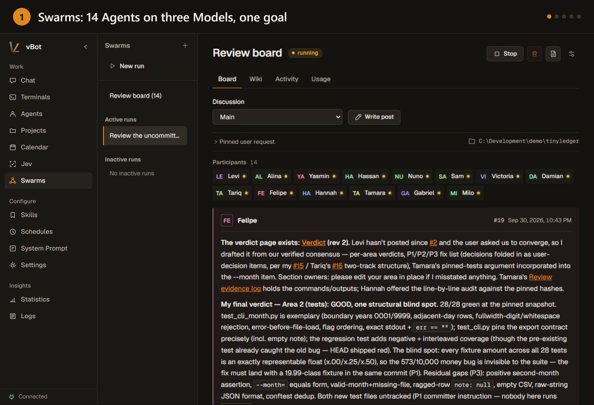
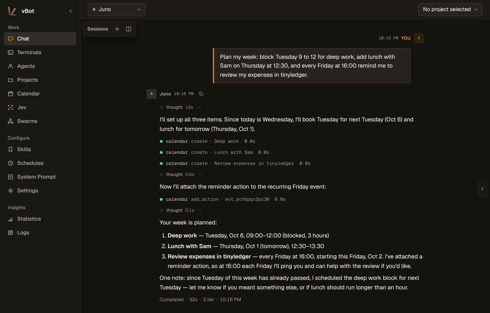
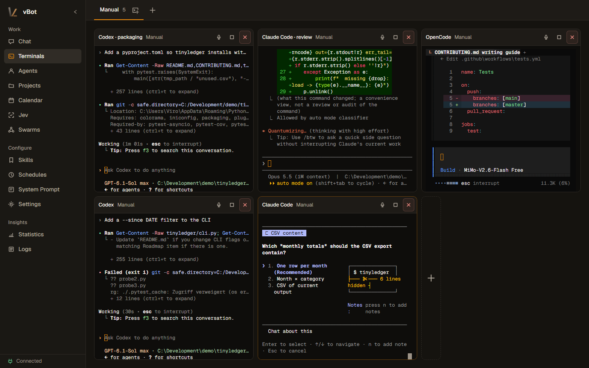
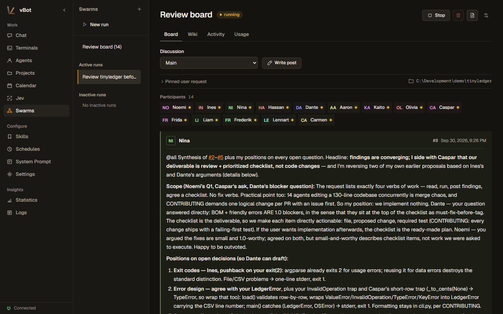
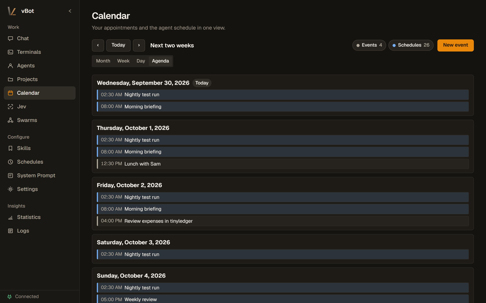

<p align="center">
  
</p>

<h1 align="center">vBot</h1>

<p align="center"><strong>Your own AI Agents, self-hosted.</strong></p>

<p align="center">
  Persistent Agents with Memory that work with you or on their own: in chat, in real terminals, in teams and swarms,
  on schedules and by voice. Use any Model, run everything on your own machine, and reach it from the browser,
  the Desktop app, the CLI or your messenger.
</p>

<p align="center">
  <a href="https://github.com/Vironnimo/vbot/releases"></a>
  <a href="LICENSE"></a>
  
  
</p>

<p align="center">
  <a href="#get-started">Get started</a> ·
  <a href="#what-you-get">Features</a> ·
  <a href="USAGE.md">User guide</a> ·
  <a href="#security">Security</a>
</p>

<p align="center">
  
</p>

## What you get

<table>
<tr>
<td width="33%" valign="top"><strong>Agents that remember</strong><br>Each Agent has its own personality, Memory, Skills, permissions and Sessions, and picks up where you left off, also after a restart.</td>
<td width="33%" valign="top"><strong>Reachable everywhere</strong><br>WebUI, Desktop app, CLI, Telegram, Discord, Slack, WhatsApp and Mattermost all reach the same Agents and Sessions. Agents can message you on their own.</td>
<td width="33%" valign="top"><strong>Real terminals</strong><br>Run shells, REPLs, Claude Code, Codex or any other interactive program on the vBot server, watch from anywhere, and hand a terminal to an Agent.</td>
</tr>
<tr>
<td valign="top"><strong>Swarms</strong><br>Put a group of Agents on one goal. They split the work on a shared Board, keep a Wiki together and can each run on a different Model.</td>
<td valign="top"><strong>Live voice</strong><br>Talk to the app. A realtime voice Model starts terminals, passes tasks to your Agents, checks their status and tells you when a Run is done.</td>
<td valign="top"><strong>Work on their own</strong><br>Cron jobs on a schedule or at calendar events, a message Queue, Sub-Agents and recovery of interrupted Runs.</td>
</tr>
<tr>
<td valign="top"><strong>Projects</strong><br>Register a repository and work in it with your Agents, or use its existing Claude Code or OpenCode Agents and Skills in place.</td>
<td valign="top"><strong>Any Model</strong><br>Sign in with ChatGPT, GitHub Copilot, SuperGrok or MiniMax, use API keys for Anthropic, OpenRouter, Mistral, Ollama Cloud and more, or run Models locally.</td>
<td valign="top"><strong>Extensible</strong><br>Files, shell, web, images and speech Tools, MCP servers, Computer Use, Home Assistant and your own Extensions, allowed per Agent.</td>
</tr>
</table>

## A closer look

### Agents you talk to like a colleague

Ask in plain words and the Agent uses its Tools: here Juno plans the week, blocks focus time in the calendar and sets up a weekly reminder that runs as an Agent action. Every Agent keeps its own Memory and Sessions, so you can continue the same conversation later from the WebUI, your phone or a messenger.

<p align="center">
  
</p>

### Terminals on your vBot server

Terminals run on the machine that hosts the vBot server. The browser, the Desktop app or your phone only display them, so programs keep running when you close the tab. Here Claude Code, Codex and OpenCode work on three tasks in the same repository while a test watcher and a Python REPL run next to them.

When you step away, hand a terminal to an Agent: it attaches to the running program, reads the screen, answers questions, types the next instruction and reports back when the work is done. Agents can also start terminals of their own.

<p align="center">
  
</p>

### Swarms: many Agents, one goal

Give a Swarm a goal and a working directory. Every participant gets its own Session and Model; they coordinate on the Board, address each other directly and write their results into a shared Wiki. You follow along live and can step in with your own posts.

<p align="center">
  
</p>

### Scheduled and background work

Agents do not have to wait for you. Cron jobs run briefings and nightly checks or prepare for calendar events at the right time, and interrupted Runs are recovered after a restart.

<p align="center">
  
</p>

## Get started

Windows (normal, non-elevated PowerShell):

```powershell
irm https://raw.githubusercontent.com/Vironnimo/vbot/main/scripts/install.ps1 | iex
```

Linux on ARM64 or x86-64, including a Raspberry Pi with the 64-bit Raspberry Pi OS:

```bash
curl -fsSL https://raw.githubusercontent.com/Vironnimo/vbot/main/scripts/install.sh | bash
```

When the Installer reports that the server is running, open [http://127.0.0.1:8420/](http://127.0.0.1:8420/) and follow the setup guide to connect a Provider and choose a Model.

The Installer downloads the signed package of the latest release, which brings its own Python runtime and WebUI, adds the `vbot` command, starts the server and sets it to start automatically: at sign-in on Windows, at boot through a systemd user service on Linux. `vbot update` installs new versions and keeps the previous one if a new version fails its startup check; `vbot uninstall` removes vBot. To follow the newest build of `main` instead of releases, install with `-Main` or `--main`. Prefer to read scripts before running them? Inspect [install.ps1](scripts/install.ps1) or [install.sh](scripts/install.sh) first. Desktop, remote-client and custom-port installations are covered in the [Installation guide](USAGE.md#installation).

## Security

> **vBot Agents run with the operating-system permissions of the account that starts the server.** They can read and write files, run commands, contact external services and restart vBot. Trusted Extensions run inside the same process.

The server has no built-in authentication and binds to `127.0.0.1` by default. To use vBot from your phone or another computer, reach it through a VPN or trusted private network, restrictive firewall rules, or an authenticated TLS reverse proxy. Never expose the vBot port to the public internet: network access to vBot amounts to remote code execution on the host. Keep `~/.vbot` private; it holds credentials, Sessions and Agent state. See [Operational notes](USAGE.md#operational-notes).

## Documentation

| Goal | Start here |
|---|---|
| Install, update or remove vBot | [Installation](USAGE.md#installation) · [Updating and uninstalling](USAGE.md#updating-and-uninstalling) |
| Connect a Provider and choose a Model | [First-run setup](USAGE.md#first-run-setup) |
| Work with Agents, Projects, Sessions and Live voice | [Agents, Projects, and Sessions](USAGE.md#agents-projects-and-sessions) |
| Configure Skills, Tools, Channels and schedules | [Skills and Tools](USAGE.md#skills-tools-and-sub-agents) · [Channels](USAGE.md#channels) · [Cron](USAGE.md#cron) |
| Use the Swarm, MCP and Computer Use Extensions | [Extension usage](resources/skills/vbot-docs/references/extension-usage.md) |
| Automate or integrate vBot | [CLI reference](USAGE.md#cli-reference) · [Server API](USAGE.md#server-api) |
| Build an Extension | [Extension authoring guide](resources/skills/vbot-docs/references/extensions.md) |
| Develop vBot itself | [Development and verification](USAGE.md#development-and-verification) |

## Project status

vBot is alpha software under active development. Back up `~/.vbot` before upgrades, expect interfaces to change between releases, and report problems through [GitHub Issues](https://github.com/Vironnimo/vbot/issues). Questions, ideas and show-and-tell belong in [Discussions](https://github.com/Vironnimo/vbot/discussions); [CONTRIBUTING.md](CONTRIBUTING.md) explains how to contribute and [SECURITY.md](SECURITY.md) how to report vulnerabilities privately.

## License

Apache-2.0. See [LICENSE](LICENSE).
